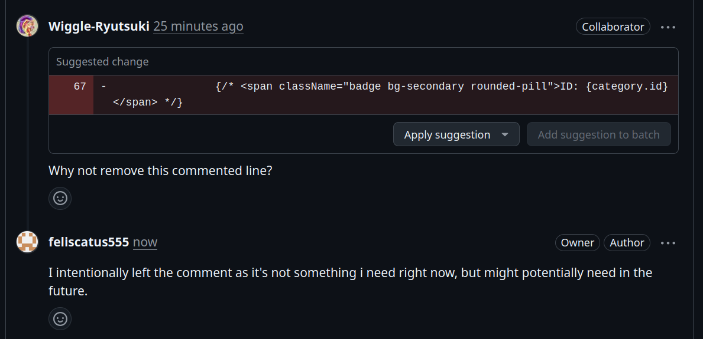

# Lab 1 — Peer Review Record  (fill this in)

**Author:** <Iris French> — <67070503478> — GitHub: @feliscatus555  
**Peer reviewer:** <Maimoona Aziz> — <67070503473> — GitHub: @Wiggle-Ryutsuki

## Pull Requests I authored (reviewed by my partner)
| PR | Branch | Reviewer verdict |
|----|--------|------------------|
| foundation of the project, front end and back end starts succesfully #6 | feature/1-project-foundation | Approved |
| Health check working #7 | feature/2-health-check | Looks good, approved  |
| Prisma category model creation and seeding #8 | feature/3-category-seed | All in order, approved. |
| Feature/4 category list #9 | feature/4-category-list | Approved, well done |
| Lab 1 release #10 | lab1-staging | Approved |

Reviewer comment: Why not remove this commented line?

How I responded: I intentionally left the comment as it's not something i need right now, but might potentially need in the future.

## Pull Requests I reviewed for my partner
My comment: < The appropriate code has been made for issue 2, well done. >
Partner's response: < Thank you. >
