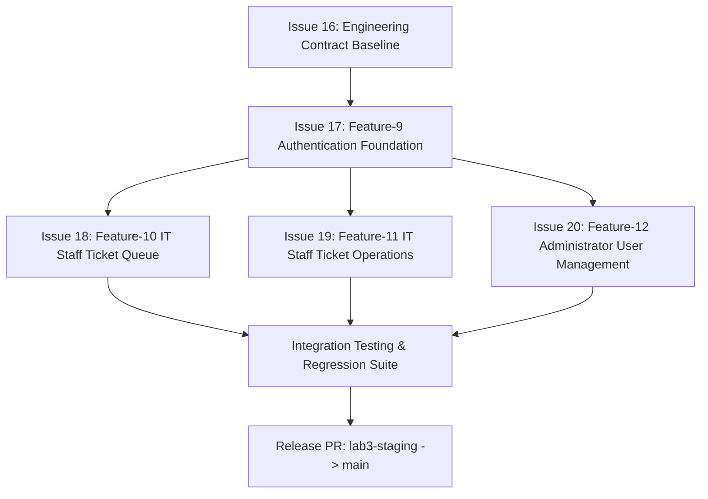

# Lab 3 Sprint Engineering Specification — TokTickIT

## Document Control & Citation Reference
* **Document Status**: Draft Sprint 3 Engineering Specification Baseline
* **Target Sprint**: Lab 3 — TokTickIT Users, Roles, IT Staff Ticketing, and Admin Screens
* **Target Branch**: `lab3-staging`
* **Base References**:
  * `docs/lab-03/Lab_3_sheet.pdf` (Lab 3 Labsheet & Handout)
  * `docs/lab-02/specification.md` (Lab 2 Engineering Specification Baseline)

---

## 1. Sprint Goal
Deliver the multi-role identity, authentication, IT Staff operational workflows, and minimalist administrator user management increment of TokTickIT. By the end of Sprint 3, the temporary Development Requester selector is completely retired and replaced with real credential authentication, session management, and mandatory first-login password changes. Requesters continue managing their own tickets and attachments using their authenticated identity while gaining the ability to post Public Comments and indicate issue resolution. IT Staff can manage incoming requests through a shared, responsive Ticket Queue, inspect ticket details, claim or reassign ticket ownership, set IT Priority, execute permitted status transitions, post Public Comments, and record role-restricted private Internal Notes. Administrators can manage user accounts through a minimalist User Management screen (create, edit, activate/deactivate, and issue initial passwords) governed by strict safety rules preventing self-deactivation and orphan system states, all implemented under the Zen Green design system and verified through Spec DD and Test DD.

---

## 2. Stakeholder Request Interpretation
The stakeholder requires TokTickIT to transition from a development prototype with simulated requester switching to a secure, role-governed multi-user service desk (`docs/lab-03/Lab_3_sheet.pdf`, Section 3). Real users authenticate via email and password; any account provisioned with an initial password must change it immediately before accessing the application. Requesters must retain all ticket and attachment capabilities built in Lab 2 without regression, but identity must be derived strictly from the authenticated account rather than client-supplied parameters (`Lab_3_sheet.pdf`, Section 3, Section 4.4 BR-03). IT Staff require a dedicated Ticket Queue and operational Ticket Detail view to locate work, assign owners, set IT Priority, move tickets through their lifecycle, communicate with requesters via Public Comments, and record private operational Internal Notes (`Lab_3_sheet.pdf`, Section 3). Administrators require a minimalist User Management interface to oversee accounts and assign exactly one permitted role (`Lab_3_sheet.pdf`, Section 3, Section 4.3). All screens and APIs must enforce strict role-based authorization and ownership checks on the backend rather than relying on hidden UI controls (`Lab_3_sheet.pdf`, Section 3, Section 4.3).

---

## 3. Scope

### 3.1 Included Scope (Feature-9 through Feature-12)
* **Feature-9: Authentication Foundation & Mandatory Password Change** (`Lab_3_sheet.pdf`, Section 1, 4.1, 6, 8.1):
  * Real user authentication with email and password.
  * Rejection of inactive accounts.
  * Mandatory password change flow on first login before accessing normal application screens.
  * Password rules, confirmation validation, and credential security.
  * Current authenticated user retrieval (`GET /api/auth/me`) and secure logout (`POST /api/auth/logout`).
  * Removal of Lab 2 Development Requester selector and all simulated requester state.
* **Feature-10: IT Staff Ticket Queue** (`Lab_3_sheet.pdf`, Section 1, 4.1, 6, 6.3, 8.3):
  * Shared IT Staff Ticket Queue API with search, filtering, sorting, and pagination.
  * Queue view with justified fields: Ticket Number, Created Date, Summary, Category, Requested Priority, IT Priority, Current Status, Ticket Owner, and Last Updated.
  * Queue counts, clear ownership and status badges, and action to open Ticket Detail.
  * Meaningful loading, empty, no-results, forbidden, and safe failure feedback.
  * Responsive desktop table and mobile card representation.
* **Feature-11: IT Staff Ticket Operations & Collaboration** (`Lab_3_sheet.pdf`, Section 1, 4.1, 4.5, 4.6, 6, 8.2, 8.4):
  * Operational Ticket Detail view for IT Staff.
  * Ticket ownership assignment (claim unassigned, reassign to active IT Staff or Administrator).
  * IT Priority initialization (copying Requested Priority) and subsequent updates by IT Staff/Admin.
  * Ticket status lifecycle engine covering: `New`, `Open`, `In Progress`, `Waiting for Requester`, `Resolved`, `Closed`, `Reopened`, and `Cancelled`.
  * Public Comments: append-only shared communication visible to Requester, IT Staff, and Administrator.
  * Internal Notes: append-only operational notes visible only to IT Staff and Administrator, forbidden to Requesters.
  * Requester "Problem Appears Resolved" indication on owned tickets.
  * Requester regression: preservation of all Lab 2 Ticket and Attachment functions using authenticated Requester identity.
* **Feature-12: Administrator User Management** (`Lab_3_sheet.pdf`, Section 1, 4.1, 4.3, 4.4, 6, 8.5):
  * Minimalist user listing displaying Name, Email, Role, Status, and Edit action.
  * Search users by name or email, and optional filtering by role.
  * Create user with name, email, one permitted role, activation state, and an initial password.
  * Edit user's name, email, role, and activation state.
  * Set/reset new initial password requiring change at next login.
  * Safety rules: prevent duplicate emails, prevent self-deactivation, prevent deactivation/removal of the last active Administrator, enforce deactivation over deletion.
  * Strict API and UI restriction to Administrators only.

### 3.2 Explicitly Excluded Scope
The following items are explicitly excluded from Lab 3 (`docs/lab-03/Lab_3_sheet.pdf`, Section 4.2, Section 8.5):
* Email invitations, password-reset emails, multi-factor authentication (MFA), social login, and single sign-on (SSO).
* Self-registration and Requester-created accounts.
* Actions Taken by IT Staff (deferred to Lab 4 per Section 4.5).
* Formal SLA calculations, escalation rules, and automated notification services.
* Dashboards and KPI analytics beyond simple queue counts.
* Multi-tenant organizations, departments, and customer administration.
* Production-grade deployment or cloud infrastructure changes.
* Multiple roles assigned to one user (strictly one role per user).
* User deletion, bulk user operations, user import or export, and account-history screens.
* Department, organization, profile-photo, and other extended user-profile management.
* Email delivery of initial passwords or reset links.
* Account unlocking, administrator approval workflows, and advanced identity-management functions.
* Advanced user-list features such as mandatory pagination, multi-column sorting, and multiple simultaneous filters on the user list.

---

## 4. GitHub Issues Decomposition, Dependencies, Branch Names & Merge Order

### 4.1 Issue Breakdown & Branch Strategy
Sprint 3 is decomposed into 5 sequential GitHub Issues (`Lab_3_sheet.pdf`, Section 11, Section 11.1):

| Issue # | Issue Title | Target Feature | Branch Name | Scope |
|---|---|---|---|---|
| **Issue 16** | `Sprint 3 engineering contract and baseline specifications` | Contract / Spec DD | `contract/lab-03-spec` | `specification.md`, `tests.md`, `ui-spec.md`, `api-spec.md` |
| **Issue 17** | `Authentication foundation, user migration, and password change` | Feature-9 | `feature/9-auth-foundation` | `User` Prisma model, password hashing, login/logout/me APIs, first-login password change UI/API, retire Dev Requester selector, unit & API tests |
| **Issue 18** | `IT Staff Ticket Queue with search, filtering, and pagination` | Feature-10 | `feature/10-staff-queue` | Queue retrieval API (`GET /api/staff/tickets`), responsive desktop/mobile UI, search/filter/sort, pagination, badge display, tests |
| **Issue 19** | `IT Staff Ticket operations, comments, notes, and status workflow` | Feature-11 | `feature/11-staff-ticket-operations` | Ticket detail operational extensions, ownership claim/assign, IT priority, status workflow, Public Comments, Internal Notes, Requester resolution flag, regression tests |
| **Issue 20** | `Administrator user management and safety rules` | Feature-12 | `feature/12-admin-user-management` | User list API & UI, search/role filter, create user, edit user, set initial password, self-deactivation & last-admin guards, tests |

### 4.2 Dependencies & Integration Sequence


### 4.3 Merge Order into `lab3-staging`
1. **Merge Contract**: `contract/lab-03-spec` merged directly into `lab3-staging` before any implementation PR.
2. **Merge PR 1 (Issue 17 / Feature-9)**: `feature/9-auth-foundation` -> `lab3-staging`. Establishes the `User` table, authentication middleware, login/logout endpoints, and first-login gate required by all subsequent features.
3. **Merge PR 2 (Issue 18 / Feature-10)**: `feature/10-staff-queue` -> `lab3-staging`. Implements IT Staff queue endpoints and responsive UI.
4. **Merge PR 3 (Issue 19 / Feature-11)**: `feature/11-staff-ticket-operations` -> `lab3-staging`. Adds ticket operational actions, status workflow engine, comments, and notes.
5. **Merge PR 4 (Issue 20 / Feature-12)**: `feature/12-admin-user-management` -> `lab3-staging`. Adds administrator user management endpoints, modal forms, and safety rules.
6. **Release PR**: Final release PR from `lab3-staging` into `main` after full automated test suites pass.

---

## 5. Functional Requirements (FR)

### Feature-9: Authentication Foundation & Mandatory Password Change
* **FR-01** `[Source Requirement]`: The system shall authenticate users using email address and password (`Lab_3_sheet.pdf`, Section 1, Section 6, Section 8.1).
* **FR-02** `[Source Requirement]`: The system shall reject authentication attempts for inactive user accounts (`isActive = false`) with a safe error message (`Lab_3_sheet.pdf`, Section 4.4 BR-01, Section 8.1).
* **FR-03** `[Source Requirement]`: The system shall require any user with an initial password (`mustChangePassword = true`) to change their password upon first login before granting access to normal application screens (`Lab_3_sheet.pdf`, Section 1, Section 3, Section 4.4 BR-02, Section 8.1).
* **FR-04** `[Source Requirement]`: The system shall provide an endpoint to validate and update the initial password (`POST /api/auth/change-password`), clearing the password-change requirement upon success (`Lab_3_sheet.pdf`, Section 6, Section 8.1).
* **FR-05** `[Source Requirement]`: The system shall provide an endpoint to retrieve the currently authenticated user (`GET /api/auth/me`), returning user identity, display name, and role (`Lab_3_sheet.pdf`, Section 4.1, Section 6).
* **FR-06** `[Source Requirement]`: The system shall provide a logout endpoint (`POST /api/auth/logout`) that terminates authenticated access (`Lab_3_sheet.pdf`, Section 4.1, Section 6, Section 8.1).
* **FR-07** `[Source Requirement]`: The application shell shall display the authenticated user's name and role badge, provide a visible Logout action, and present only role-permitted navigation links (`Lab_3_sheet.pdf`, Section 7, Section 8.1).
* **FR-08** `[Source Requirement]`: The system shall eliminate the Development Requester selector and remove all client-side simulated requester state (`Lab_3_sheet.pdf`, Section 1, Section 3, Section 5.2, Section 8.2).
* **FR-09** `[Source Requirement]`: All Lab 2 Requester functions (ticket creation, list, detail, attachment upload, download, and soft removal) shall continue functioning without regression using the authenticated Requester identity (`Lab_3_sheet.pdf`, Section 1, Section 3, Section 5.2, Section 8.2).

### Feature-10: IT Staff Ticket Queue
* **FR-10** `[Source Requirement]`: The system shall provide an IT Staff Ticket Queue API (`GET /api/staff/tickets`) supporting search, filtering, sorting, and pagination (`Lab_3_sheet.pdf`, Section 6, Section 6.3).
* **FR-11** `[Source Requirement]`: The IT Staff Queue shall support searching tickets by ticket number or summary (`Lab_3_sheet.pdf`, Section 6.3, Section 8.3, page 9 mockup).
* **FR-12** `[Source Requirement]`: The IT Staff Queue shall support filtering tickets by category, status, priority, and assigned/unassigned ownership (`Lab_3_sheet.pdf`, Section 6.3, Section 8.3).
* **FR-13** `[Source Requirement]`: The IT Staff Queue shall support sorting with documented default ordering and safe fallback for invalid query parameters (`Lab_3_sheet.pdf`, Section 6.3).
* **FR-14** `[Source Requirement]`: The IT Staff Queue API shall return pagination metadata including current page, total pages, page size, and total record count (`Lab_3_sheet.pdf`, Section 6.3, page 9 mockup).
* **FR-15** `[Source Requirement]`: The IT Staff Queue UI shall display justified fields: Ticket Number, Created Date, Summary, Category, Requested Priority, IT Priority, Current Status, Ticket Owner, and Last Updated (`Lab_3_sheet.pdf`, Section 8.3).
* **FR-16** `[Source Requirement]`: The IT Staff Queue UI shall provide an action on each ticket item to navigate to the IT Staff Ticket Detail view (`Lab_3_sheet.pdf`, Section 3, Section 8.3).
* **FR-17** `[Source Requirement]`: The IT Staff Queue shall be accessible only to IT Staff (and Administrator if authorized), returning `403 Forbidden` for Requesters (`Lab_3_sheet.pdf`, Section 4.3, Section 6.2).
* **FR-18** `[Source Requirement]`: The IT Staff Queue shall provide a responsive layout adapting from a desktop table to a card view on smaller viewports without horizontal scrolling (`Lab_3_sheet.pdf`, Section 7, Section 8.3, Section 8.7).

### Feature-11: IT Staff Ticket Operations & Collaboration
* **FR-19** `[Source Requirement]`: The system shall retrieve full ticket detail for IT Staff operations (`GET /api/staff/tickets/:id`) (`Lab_3_sheet.pdf`, Section 6, Section 8.4).
* **FR-20** `[Source Requirement]`: The system shall allow an IT Staff or Administrator user to claim an unassigned ticket or reassign ownership to an active IT Staff or Administrator (`Lab_3_sheet.pdf`, Section 1, Section 3, Section 4.5, Section 6, Section 8.4).
* **FR-21** `[Source Requirement]`: The system shall allow IT Staff or Administrator to update IT Priority (`Lab_3_sheet.pdf`, Section 1, Section 4.5, Section 6, Section 8.4).
* **FR-22** `[Source Requirement]`: The system shall automatically initialize IT Priority with the value of Requested Priority upon ticket creation (`Lab_3_sheet.pdf`, Section 4.5).
* **FR-23** `[Source Requirement]`: The system shall enforce permitted ticket status transitions across `New`, `Open`, `In Progress`, `Waiting for Requester`, `Resolved`, `Closed`, `Reopened`, and `Cancelled` (`Lab_3_sheet.pdf`, Section 4.5, Section 6).
* **FR-24** `[Source Requirement]`: The system shall allow Requesters, IT Staff, and Administrators to create and retrieve append-only Public Comments on a ticket (`Lab_3_sheet.pdf`, Section 1, Section 4.4 BR-04, Section 4.6, Section 6, Section 8.2, Section 8.4).
* **FR-25** `[Source Requirement]`: The system shall allow IT Staff and Administrators to create and retrieve append-only Internal Notes on a ticket (`Lab_3_sheet.pdf`, Section 1, Section 4.4 BR-04, Section 4.6, Section 6, Section 8.4).
* **FR-26** `[Source Requirement]`: The system shall reject Requester access to Internal Notes endpoints with `403 Forbidden` without revealing note existence or content (`Lab_3_sheet.pdf`, Section 4.4 BR-04, Section 6.2; Section 9.1 AC-04).
* **FR-27** `[Source Requirement]`: The system shall automatically record author ID and backend timestamp for every comment and note (`Lab_3_sheet.pdf`, Section 4.6).
* **FR-28** `[Source Requirement]`: The system shall reject empty or whitespace-only comments and notes (`Lab_3_sheet.pdf`, Section 4.6).
* **FR-29** `[Source Requirement]`: The system shall allow the ticket's owning Requester to indicate that the reported problem appears resolved (`Lab_3_sheet.pdf`, Section 1, Section 3, Section 4.4 BR-05, Section 8.2).
* **FR-30** `[Source Requirement]`: The system shall restrict formal resolution (`Resolved`) and closing (`Closed`) of tickets exclusively to IT Staff (`Lab_3_sheet.pdf`, Section 3, Section 4.4 BR-05).
* **FR-31** `[Source Requirement]`: The UI shall visually distinguish Public Comments from Internal Notes to prevent accidental public posting of internal operational notes (`Lab_3_sheet.pdf`, Section 8.4).

### Feature-12: Administrator User Management
* **FR-32** `[Source Requirement]`: The system shall provide an endpoint for Administrators to list users (`GET /api/admin/users`) with search by name or email, and optional role filtering (`Lab_3_sheet.pdf`, Section 6, Section 8.5).
* **FR-33** `[Source Requirement]`: The user list UI shall display Name, Email, Role, Status, and an Edit action (`Lab_3_sheet.pdf`, Section 8.5).
* **FR-34** `[Source Requirement]`: The system shall allow an Administrator to create a user account (`POST /api/admin/users`) with name, email address, one permitted role (`Requester`, `IT Staff`, `Administrator`), activation state, and an initial password (`Lab_3_sheet.pdf`, Section 4.4, Section 6, Section 8.5).
* **FR-35** `[Source Requirement]`: The system shall reject user creation or update with a duplicate email address (`Lab_3_sheet.pdf`, Section 4.4, Section 8.5).
* **FR-36** `[Source Requirement]`: The system shall allow an Administrator to update a user's name, email address, role, and activation state (`PATCH /api/admin/users/:id`) (`Lab_3_sheet.pdf`, Section 4.4, Section 6, Section 8.5).
* **FR-37** `[Source Requirement]`: The system shall allow an Administrator to issue a new initial password for a user (`POST /api/admin/users/:id/reset-password`), which marks the user as requiring a password change at next login (`Lab_3_sheet.pdf`, Section 4.4, Section 6, Section 8.5).
* **FR-38** `[Source Requirement]`: The system shall prevent an Administrator from deactivating their own account (`Lab_3_sheet.pdf`, Section 4.4, Section 8.5).
* **FR-39** `[Source Requirement]`: The system shall prevent deactivating or removing the role of the last active Administrator in the system (`Lab_3_sheet.pdf`, Section 4.4, Section 8.5).
* **FR-40** `[Source Requirement]`: The system shall use account deactivation (`isActive = false`) and disallow user record deletion (`Lab_3_sheet.pdf`, Section 4.2, Section 4.4, Section 8.5).
* **FR-41** `[Source Requirement]`: User management APIs and UI screens shall be accessible only to Administrators, returning `403 Forbidden` for Requesters and IT Staff (`Lab_3_sheet.pdf`, Section 4.3, Section 6.2, Section 8.5).

---

## 6. Business Rules (BR)

### 6.1 Mandatory Source Business Rules (Fixed by Labsheet)
* **BR-01** `[Source Requirement]`: Only an active user (`isActive = true`) with valid credentials may authenticate (`Lab_3_sheet.pdf`, Section 4.4 BR-01).
* **BR-02** `[Source Requirement]`: A user marked as requiring a password change (`mustChangePassword = true`) cannot enter the normal application until a new valid password is saved (`Lab_3_sheet.pdf`, Section 4.4 BR-02).
* **BR-03** `[Source Requirement]`: The authenticated user identity, not a `requesterId` supplied by the client, determines ownership of Requester operations (`Lab_3_sheet.pdf`, Section 4.4 BR-03).
* **BR-04** `[Source Requirement]`: Public Comments are visible to the Requester, IT Staff, and Administrator. Internal Notes are visible only to IT Staff and Administrator (`Lab_3_sheet.pdf`, Section 4.4 BR-04).
* **BR-05** `[Source Requirement]`: A Requester may indicate that the problem appears resolved, but cannot formally set the Ticket to `Resolved` or `Closed` (`Lab_3_sheet.pdf`, Section 4.4 BR-05).
* **BR-06** `[Source Requirement]`: Each Ticket may have zero or one primary Ticket Owner who is an active IT Staff or Administrator user (`Lab_3_sheet.pdf`, Section 4.5, Section 5.1).
* **BR-07** `[Source Requirement]`: Requested Priority remains the value submitted by the Requester. IT Priority initially copies Requested Priority and may later be changed only by IT Staff or Administrator (`Lab_3_sheet.pdf`, Section 4.5).
* **BR-08** `[Source Requirement]`: The required Ticket statuses are `New`, `Open`, `In Progress`, `Waiting for Requester`, `Resolved`, `Closed`, `Reopened`, and `Cancelled` (`Lab_3_sheet.pdf`, Section 4.5).
* **BR-09** `[Source Requirement]`: Public Comments and Internal Notes are append-only. Editing and deletion are excluded (`Lab_3_sheet.pdf`, Section 4.6).
* **BR-10** `[Source Requirement]`: Each Comment or Note records its author and creation timestamp from the backend (`Lab_3_sheet.pdf`, Section 4.6).
* **BR-11** `[Source Requirement]`: Empty or whitespace-only comment and note content is rejected (`Lab_3_sheet.pdf`, Section 4.6).
* **BR-12** `[Source Requirement]`: One user has exactly one permitted role in Lab 3: `Requester`, `IT Staff`, or `Administrator` (`Lab_3_sheet.pdf`, Section 4.2, Section 5.1).
* **BR-13** `[Source Requirement]`: An Administrator cannot deactivate their own account (`Lab_3_sheet.pdf`, Section 4.4, Section 8.5).
* **BR-14** `[Source Requirement]`: The system must prevent removing or deactivating the last active Administrator (`Lab_3_sheet.pdf`, Section 4.4, Section 8.5).
* **BR-15** `[Source Requirement]`: User deletion is prohibited; account deactivation must be used instead (`Lab_3_sheet.pdf`, Section 4.2, Section 4.4, Section 8.5).
* **BR-16** `[Source Requirement]`: Passwords must never be stored in plaintext (`Lab_3_sheet.pdf`, Section 5.1).
* **BR-17** `[Source Requirement]`: Lab 3 does not include Actions Taken, so the later rule that blocks resolution while Actions Taken remain incomplete is deferred to Lab 4 (`Lab_3_sheet.pdf`, Section 4.5).

### 6.2 Proposed Decisions (Resolving Unspecified Design Choices)
* **BR-18** `[Proposed Decision]`: **Password Complexity Policy**: Passwords must be at least 8 characters long and contain at least one uppercase letter, one lowercase letter, one numeric digit, and one special character (matching wireframe cues in `Lab_3_sheet.pdf`, page 8).
* **BR-19** `[Proposed Decision]`: **Password Hashing**: Passwords shall be hashed using `bcrypt` (or `node:crypto` scrypt / argon2) with a work factor / salt rounds of 10. Plaintext passwords must be discarded from memory immediately after hashing.
* **BR-20** `[Proposed Decision]`: **Authentication Session Mechanism**: Authentication tokens shall be issued as signed JSON Web Tokens (JWT) or HTTP-only signed session cookies with a 24-hour expiration window.
* **BR-21** `[Proposed Decision]`: **Initial Password Provisioning**: When an Administrator creates a user or resets a password, the initial password may be entered by the Administrator or system-generated; the initial password is displayed to the Administrator once with a copy button and never emailed (`Lab_3_sheet.pdf`, Section 4.2, Section 6).
* **BR-22** `[Proposed Decision]`: **Ticket Status Transition Rules**:
  * `New` -> `Open`, `Cancelled`
  * `Open` -> `In Progress`, `Waiting for Requester`, `Resolved`, `Cancelled`
  * `In Progress` -> `Waiting for Requester`, `Resolved`, `Cancelled`
  * `Waiting for Requester` -> `In Progress`, `Resolved`, `Cancelled`
  * `Resolved` -> `Closed`, `Reopened`
  * `Closed` -> `Reopened` (IT Staff / Admin only)
  * `Cancelled` -> (terminal state, no transitions permitted)
  * Requesters can only submit initial tickets (status `New`) and set `isProblemAppearsResolved = true`; formal status changes are restricted to IT Staff and Administrators.
* **BR-23** `[Proposed Decision]`: **Comment & Note Length Constraints**: Public Comments and Internal Notes must have a trimmed length between 1 and 2,000 characters.
* **BR-24** `[Proposed Decision]`: **Queue Pagination Defaults**: Default pagination for IT Staff Queue is `page = 1` and `limit = 10` (maximum permitted `limit = 50`). Default ordering is `createdAt DESC`.
* **BR-25** `[Proposed Decision]`: **Administrator Operational Privileges**: Administrators have read/write access to user management and read/comment access to tickets; ticket ownership and status transitions are primary to IT Staff, but Administrators are permitted to claim/reassign and change status if needed to support administrative oversight (`Lab_3_sheet.pdf`, Section 4.3).

---

## 7. UI Specification Summary
* Reference: [`docs/lab-03/ui-spec.md`](file:///home/iris/Documents/toktickit/docs/lab-03/ui-spec.md)
* **Visual Theme**: Reuses the Zen Green design system established in Lab 2 (`#006B3C` Primary Green, `#0B7A46` Secondary Green, `#EAF6EF` Pale Green, `#F5F7F6` Page Canvas, `#B3261E` Validation Error).
* **Application Shell**:
  * Development Requester selector completely replaced by authenticated user display (e.g. `👤 Jennifer Anderson [IT Staff]`).
  * Logout button and role-specific navigation tabs.
  * Role navigation matrix:
    * `Requester`: "My Tickets", "Create Ticket"
    * `IT Staff`: "My Queue", "Create Ticket"
    * `Administrator`: "User Management"
* **Login & First-Login Password Change**:
  * Clean card-based login interface on `#F5F7F6` canvas with email, password, validation, busy spinner, and safe failure feedback.
  * Mandatory Change Password view displaying rules checklist (8+ chars, uppercase, lowercase, number, special char), password confirmation matching, and continuous transition into the app upon success.
* **IT Staff Ticket Queue**:
  * Filter & search bar (search input, category, priority, status, and owner filters).
  * Desktop table view displaying Ticket No, Created Date, Summary, Category, Req Priority, IT Priority, Status, and Owner.
  * Mobile stacked card view for viewports `< 768px`.
  * Pagination footer `< Previous 1 2 3 ... Next >`.
* **IT Staff Ticket Detail**:
  * Displays grouped ticket information with clear editable vs read-only styling.
  * Ticket Owner dropdown (Claim / Assign action).
  * IT Priority dropdown.
  * Status transition workflow action bar.
  * Tabbed or distinctly styled sections for Public Comments (green accent) and Internal Notes (amber/gold lock accent).
  * Requester view displays "Problem Appears Resolved" toggle/button and hides Internal Notes.
* **Administrator User Management**:
  * Minimalist user list displaying Name, Email, Role pill, Status toggle/badge, and Edit button.
  * Search by name/email and optional role filter.
  * "Create User" slide-over panel or modal (Name, Email, Role select, Active toggle, Initial Password field, Copy Initial Password helper).
  * "Edit User" modal and "Reset Initial Password" action.
  * Destructive safety prompts preventing self-deactivation and last-admin deactivation.

---

## 8. Data Model & Prisma Schema Changes

### 8.1 Schema Evolution from Lab 2 Baseline
1. **Migrate `RequesterUser` to `User` Model**:
   * Evolve table `RequesterUser` into `User` to store real accounts, hashed credentials, roles, and password-change flags (`Lab_3_sheet.pdf`, Section 5.1, Section 5.2).
   * Preserve existing `id Int` primary key so foreign keys from `Ticket` (`requesterId`) and `Attachment` (`deletedById`) remain intact.
2. **Add `Role` Enum**:
   * Enum `Role { REQUESTER, IT_STAFF, ADMINISTRATOR }`.
3. **Update `TicketStatus` Enum**:
   * Evolve `TicketStatus` to match Section 4.5: `New`, `Open`, `InProgress`, `WaitingForRequester`, `Resolved`, `Closed`, `Reopened`, `Cancelled`.
4. **Update `Ticket` Model**:
   * Change `ownerName String?` to `ownerId Int?` referencing `User(id)` (`Lab_3_sheet.pdf`, Section 4.5, Section 5.1).
   * Add `isProblemAppearsResolved Boolean @default(false)` (`Lab_3_sheet.pdf`, Section 1, Section 4.4 BR-05).
   * Ensure `itPriority` field uses `RequestedPriority` enum.
5. **Add `Comment` and `InternalNote` Models**:
   * Support append-only Public Comments and private Internal Notes (`Lab_3_sheet.pdf`, Section 4.6, Section 5.1).

### 8.2 Proposed Prisma Schema Representation
```prisma
enum Role {
  REQUESTER
  IT_STAFF
  ADMINISTRATOR
}

enum RequestedPriority {
  LOW
  MEDIUM
  HIGH
  URGENT
}

enum TicketStatus {
  New
  Open
  InProgress
  WaitingForRequester
  Resolved
  Closed
  Reopened
  Cancelled
}

model User {
  id                 Int            @id @default(autoincrement())
  email              String         @unique
  passwordHash       String
  displayName        String
  role               Role           @default(REQUESTER)
  isActive           Boolean        @default(true)
  mustChangePassword Boolean        @default(true)
  createdAt          DateTime       @default(now())
  updatedAt          DateTime       @updatedAt
  tickets            Ticket[]       @relation("RequesterTickets")
  assignedTickets    Ticket[]       @relation("OwnerTickets")
  comments           Comment[]
  internalNotes      InternalNote[]
}

model Category {
  id        Int      @id @default(autoincrement())
  name      String   @unique
  createdAt DateTime @default(now())
  tickets   Ticket[]
}

model RelatedSystem {
  id          Int      @id @default(autoincrement())
  name        String   @unique
  description String?
  isActive    Boolean  @default(true)
  createdAt   DateTime @default(now())
  tickets     Ticket[]
}

model Ticket {
  id                         String            @id @default(uuid())
  ticketNo                   String            @unique
  summary                    String
  description                String
  status                     TicketStatus      @default(New)
  requestedPriority          RequestedPriority
  itPriority                 RequestedPriority
  ownerId                    Int?
  owner                      User?             @relation("OwnerTickets", fields: [ownerId], references: [id])
  resolutionSummary          String?
  isProblemAppearsResolved   Boolean           @default(false)
  requesterId                Int
  requester                  User              @relation("RequesterTickets", fields: [requesterId], references: [id])
  categoryId                 Int
  category                   Category          @relation(fields: [categoryId], references: [id])
  relatedSystemId            Int
  relatedSystem              RelatedSystem     @relation(fields: [relatedSystemId], references: [id])
  version                    Int               @default(1)
  attachments                Attachment[]
  comments                   Comment[]
  internalNotes              InternalNote[]
  createdAt                  DateTime          @default(now())
  updatedAt                  DateTime          @updatedAt
}

model Attachment {
  id               String    @id @default(uuid())
  ticketId         String
  ticket           Ticket    @relation(fields: [ticketId], references: [id], onDelete: Cascade)
  originalFilename String
  mimeType         String
  sizeBytes        Int
  storageKey       String
  isDeleted        Boolean   @default(false)
  deletedAt        DateTime?
  deletedById      Int?
  deletionReason   String?
  createdAt        DateTime  @default(now())
}

model Comment {
  id        String   @id @default(uuid())
  ticketId  String
  ticket    Ticket   @relation(fields: [ticketId], references: [id], onDelete: Cascade)
  authorId  Int
  author    User     @relation(fields: [authorId], references: [id])
  content   String
  createdAt DateTime @default(now())
}

model InternalNote {
  id        String   @id @default(uuid())
  ticketId  String
  ticket    Ticket   @relation(fields: [ticketId], references: [id], onDelete: Cascade)
  authorId  Int
  author    User     @relation(fields: [authorId], references: [id])
  content   String
  createdAt DateTime @default(now())
}
```

### 8.3 Required Seed Data Strategy (`Lab_3_sheet.pdf`, Section 5.3)
The seed script (`server/prisma/seed.ts`) must execute idempotently and populate:
1. **Requesters**: At least 4 active Requester accounts and 1 inactive Requester account.
2. **IT Staff**: At least 3 active IT Staff accounts and 1 inactive IT Staff account.
3. **Administrator**: At least 1 active Administrator account for testing User Management.
4. **Initial Passwords**: Documented local test credentials (e.g. `Password123!`) with `mustChangePassword = true` for new test users, and `mustChangePassword = false` for pre-configured accounts.
5. **Tickets & Operations**: Realistic tickets distributed across statuses, priorities, assigned/unassigned ownership, plus sample Public Comments and Internal Notes.

---

## 9. API Contract Summary
* Reference: [`docs/lab-03/api-spec.md`](file:///home/iris/Documents/toktickit/docs/lab-03/api-spec.md)
* **Base Path**: `/api`
* **Authentication Endpoints**:
  * `POST /api/auth/login` (Authenticate active user, issue token/session)
  * `POST /api/auth/logout` (Invalidate session)
  * `GET /api/auth/me` (Current authenticated user profile)
  * `POST /api/auth/change-password` (Mandatory first-login or voluntary password update)
* **Requester Continuation Endpoints**:
  * `GET /api/categories`
  * `GET /api/related-systems`
  * `POST /api/tickets` (Creates ticket for authenticated user)
  * `GET /api/tickets` (Returns tickets owned by authenticated requester)
  * `GET /api/tickets/:id` (Returns ticket detail for owner or staff)
  * `POST /api/tickets/:id/attachments` (Upload attachment)
  * `GET /api/attachments/:id/download` (Download attachment binary)
  * `DELETE /api/attachments/:id` (Soft-remove attachment)
  * `PATCH /api/tickets/:id/resolve-indication` (Requester indicates problem appears resolved)
* **IT Staff Operational Endpoints**:
  * `GET /api/staff/tickets` (Paginated ticket queue with search, filter, sort)
  * `GET /api/staff/tickets/:id` (Operational ticket detail)
  * `PATCH /api/staff/tickets/:id/assignment` (Claim or reassign ticket owner)
  * `PATCH /api/staff/tickets/:id/priority` (Update IT Priority)
  * `PATCH /api/staff/tickets/:id/status` (Update permitted status)
  * `POST /api/tickets/:id/comments` (Add Public Comment)
  * `GET /api/tickets/:id/comments` (Retrieve Public Comments)
  * `POST /api/staff/tickets/:id/notes` (Add Internal Note — IT Staff/Admin only)
  * `GET /api/staff/tickets/:id/notes` (Retrieve Internal Notes — IT Staff/Admin only)
* **Administrator User Management Endpoints**:
  * `GET /api/admin/users` (List users with search and role filter)
  * `POST /api/admin/users` (Create user with one role and initial password)
  * `PATCH /api/admin/users/:id` (Update user name, email, role, activation state)
  * `POST /api/admin/users/:id/reset-password` (Set new initial password requiring change)

---

## 10. Acceptance Criteria (AC)

* **AC-01** `[Source Requirement]`: Given an active user with valid credentials, when the user logs in, then the backend establishes authenticated access and returns the permitted user identity and role (`Lab_3_sheet.pdf`, Section 9.1).
* **AC-02** `[Source Requirement]`: Given a user who must change the initial password, when login succeeds, then normal application screens remain unavailable until a valid new password is saved (`Lab_3_sheet.pdf`, Section 9.1).
* **AC-03** `[Source Requirement]`: Given an authenticated Requester, when the client supplies another requesterId, then the backend still applies the authenticated identity and does not return another Requester's data (`Lab_3_sheet.pdf`, Section 9.1).
* **AC-04** `[Source Requirement]`: Given a Requester account, when an Internal Note endpoint is requested, then the operation is rejected without exposing note content (`Lab_3_sheet.pdf`, Section 9.1).
* **AC-05** `[Proposed Decision]`: Given an inactive user account, when attempting to authenticate, then the backend returns HTTP 401 Unauthorized with a generic, safe error message.
* **AC-06** `[Proposed Decision]`: Given an authenticated user, when invoking `POST /api/auth/logout`, then the authentication token/cookie is cleared and subsequent protected requests return HTTP 401 Unauthorized.
* **AC-07** `[Proposed Decision]`: Given an authenticated IT Staff member, when viewing the Ticket Queue, then tickets across all requesters are listed with Ticket Number, Summary, Category, Req Priority, IT Priority, Status, and Owner.
* **AC-08** `[Proposed Decision]`: Given search keyword `VPN` or filter `Status = Open` on the IT Staff Queue, then only matching tickets are returned along with correct pagination metadata.
* **AC-09** `[Proposed Decision]`: Given an authenticated IT Staff user, when clicking "Claim Ticket" on an unassigned ticket, then the ticket's `ownerId` updates to the active user and is reflected immediately in the UI.
* **AC-10** `[Proposed Decision]`: Given an authenticated IT Staff user, when updating IT Priority from `Medium` to `Urgent`, then the new priority is saved and displayed with the Urgent badge while Requested Priority remains unchanged.
* **AC-11** `[Proposed Decision]`: Given a ticket in status `Open`, when IT Staff advances status to `In Progress`, then the update succeeds; when an invalid transition is attempted (e.g. `New` directly to `Closed`), then the request is rejected with HTTP 422.
* **AC-12** `[Proposed Decision]`: Given an authenticated Requester or IT Staff, when submitting a valid Public Comment, then the comment is appended with author display name and creation time visible to all permitted roles.
* **AC-13** `[Proposed Decision]`: Given an authenticated IT Staff user, when posting an Internal Note, then the note is saved and rendered in the distinct Internal Notes section; when a Requester views the same ticket, the note is completely omitted.
* **AC-14** `[Proposed Decision]`: Given an authenticated Requester, when clicking "Problem Appears Resolved", then the ticket records `isProblemAppearsResolved = true`, alerting IT Staff without formally closing the ticket.
* **AC-15** `[Proposed Decision]`: Given an authenticated Administrator, when viewing the User Management screen, then all user accounts are listed with search and role filtering.
* **AC-16** `[Proposed Decision]`: Given an Administrator creating a user with an already existing email address, then the operation is rejected with HTTP 409 Conflict and a clear field-level error.
* **AC-17** `[Proposed Decision]`: Given an Administrator attempting to deactivate their own logged-in account, then the request is rejected with HTTP 422 Unprocessable Entity.
* **AC-18** `[Proposed Decision]`: Given an Administrator attempting to deactivate the sole active Administrator in the system, then the request is rejected with HTTP 422 Unprocessable Entity.
* **AC-19** `[Proposed Decision]`: Given a non-Administrator user attempting to access `/api/admin/users`, then the server rejects the request with HTTP 403 Forbidden.
* **AC-20** `[Proposed Decision]`: Given viewport resizing to mobile width (`< 768px`), then Queue, Ticket Detail, and User Management screens adapt responsively without horizontal overflow.

---

## 11. Product Definition of Done (DoD)

### Part 1: Product Completion Checklist (`Lab_3_sheet.pdf`, Section 13)
- [ ] User authentication, credential hashing, and session management implemented cleanly.
- [ ] Mandatory first-login password change enforced before normal app screen entry.
- [ ] Development Requester selector completely removed from frontend and backend.
- [ ] IT Staff Ticket Queue implemented with search, filtering, sorting, and pagination.
- [ ] IT Staff Ticket Detail implemented with ownership assignment, IT Priority, and status transitions.
- [ ] Public Comments and role-restricted Internal Notes implemented and visually distinguished.
- [ ] Requester "Problem Appears Resolved" indication implemented without formal closing rights.
- [ ] Minimalist Administrator User Management implemented with safety guards (no self-deactivation, no orphan system).
- [ ] Lab 2 ticket creation, my tickets list, ticket detail, and attachment management preserved without regression.
- [ ] PostgreSQL Prisma schema evolved cleanly with backward-compatible migrations and idempotent seed.
- [ ] All unit, API integration, UI component, and Playwright E2E tests pass 100%.
- [ ] Responsive UI verified on desktop, tablet, and mobile with zero horizontal overflow.

### Part 2: Course Submission Checklist (`Lab_3_sheet.pdf`, Section 14)
- [ ] GitHub Issues 16 through 20 created and managed on Kanban board.
- [ ] Feature branches merged into `lab3-staging` via peer-reviewed Pull Requests.
- [ ] Documented evidence in `docs/lab-03/reviewer.md` and `docs/lab-03/ai-use.md`.
- [ ] Clean main branch release PR merged from `lab3-staging`.
- [ ] 9-part PDF report compiled strictly according to the handout structure.

---

## 12. Decision Register & Traceability Matrix

| Item | Source / Type | Decision / Value | Reference |
|---|---|---|---|
| **Product Spelling** | Source Requirement | `TokTickIT` | SDS Decision D-01 |
| **Supported Roles** | Source Requirement | `Requester`, `IT Staff`, `Administrator` (exactly 3 roles) | `Lab_3_sheet.pdf`, Section 1, 4.3 |
| **Roles per User** | Source Requirement | Strictly one permitted role per user | `Lab_3_sheet.pdf`, Section 4.2, 5.1 |
| **Ticket Statuses** | Source Requirement | `New`, `Open`, `In Progress`, `Waiting for Requester`, `Resolved`, `Closed`, `Reopened`, `Cancelled` | `Lab_3_sheet.pdf`, Section 4.5 |
| **Resolution Rights** | Source Requirement | Requesters can only indicate resolved; formal resolution/close restricted to IT Staff | `Lab_3_sheet.pdf`, Section 4.4 BR-05 |
| **Public Comments** | Source Requirement | Append-only, visible to Requester, IT Staff, Admin | `Lab_3_sheet.pdf`, Section 4.4 BR-04, 4.6 |
| **Internal Notes** | Source Requirement | Append-only, visible only to IT Staff and Admin; forbidden to Requester | `Lab_3_sheet.pdf`, Section 4.4 BR-04, 4.6, 6.2 |
| **Plaintext Passwords** | Source Requirement | Prohibited; passwords must never be stored in plaintext | `Lab_3_sheet.pdf`, Section 5.1 |
| **Admin Safety Rules** | Source Requirement | Prevent self-deactivation; prevent removing last active Admin; no user deletion | `Lab_3_sheet.pdf`, Section 4.4, 8.5 |
| **Email Dispatch** | Source Requirement | Excluded; no email invitations or password reset emails | `Lab_3_sheet.pdf`, Section 4.2, 8.5 |
| **User Pagination** | Source Requirement | Excluded from mandatory requirements; simple list is sufficient | `Lab_3_sheet.pdf`, Section 4.2, 8.5 |
| **Password Hashing** | Proposed Decision | `bcrypt` with salt rounds = 10 | Specification Section 6.2 BR-19 |
| **Password Policy** | Proposed Decision | Minimum 8 chars, 1 uppercase, 1 lowercase, 1 number, 1 special char | Specification Section 6.2 BR-18 |
| **Session Scheme** | Proposed Decision | Signed JWT Bearer token or HTTP-only signed session cookie | Specification Section 6.2 BR-20 |
| **Status Transition Matrix** | Proposed Decision | Deterministic transition validation (New->Open->InProgress/Waiting->Resolved->Closed) | Specification Section 6.2 BR-22 |
| **Comment Length Limit** | Proposed Decision | Trimmed length 1 to 2,000 characters | Specification Section 6.2 BR-23 |
| **Admin Ticket Rights** | Proposed Decision | Admin can view queue and details, and assist with ticket assignment if needed | Specification Section 6.2 BR-25 |
